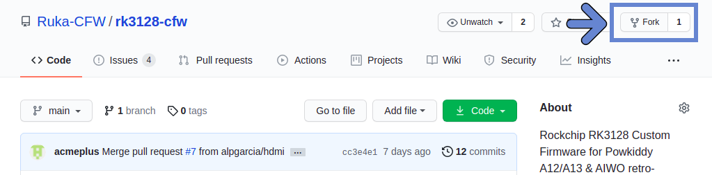
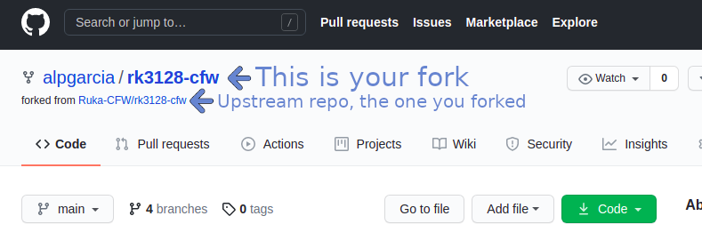
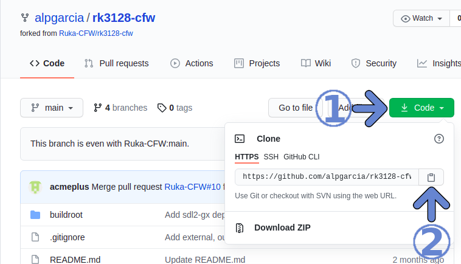
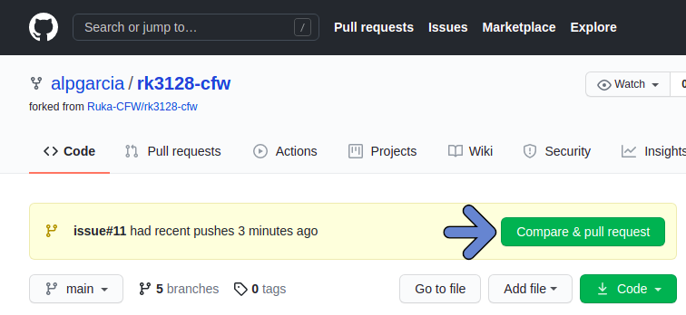
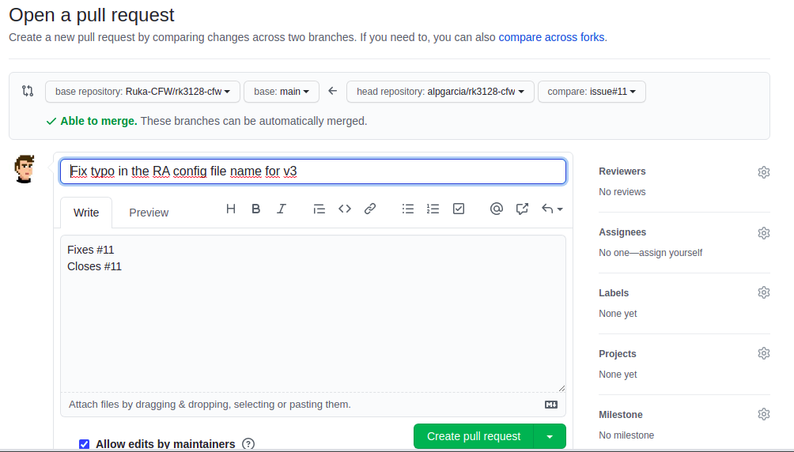

**This document is available in [ en ]**

------

# Pull Request example

This is a practical example to show how to send a simple PR according to the process detailed on our [CONTRIBUTING file](/CONTRIBUTING.md). This process is valid for any kind of contribution, code or documentation. For the latter one it is also possible, and sometimes easier, to directly use the GitHub interface that allows to edit documents online and create the Pull Request in a couple of clicks.

## Document TOC

* [Setting up your fork](#setting-up-your-fork)
* [Creating your Pull Request](#creating-your-pull-request)
* [Final words](#final-words)
* [Changelog](#changelog)

## Setting up your fork

Skip this part if you already have a fork synced to upstream.

* Fork the project. Go to the GitHub project page and click on the fork button at the top right corner.



* Now you have your own copy of the project, that means you have permission to modify things as you wish without affecting the original project repository (where in any case you won't have write permission).



* Clone your fork:
  - Get the URL:

  - Clone it:
  ```sh
  git clone <URL>
  ```

* Change to the directory you just cloned.
```sh
$> cd rk3128-cfw
```

* Make sure you configure the upstream repository as a remote so you will be able to fetch newer changes from upstream later on, if needed.

  - First check your remotes:
  ```sh
  $> git remote -v
  origin  https://github.com/alpgarcia/rk3128-cfw.git (fetch)
  origin  https://github.com/alpgarcia/rk3128-cfw.git (push)
  ```
  - Add upstream (if needed). To get the URL do the same you did for your fork, but on the upstream repository page. Then:
  ```sh
  $> git remote add upstream <upstream_URL>
  ```
  - Check the result:
  ```sh
  $> git remote -v
  origin  https://github.com/alpgarcia/rk3128-cfw.git (fetch)
  origin  https://github.com/alpgarcia/rk3128-cfw.git (push)
  upstream        https://github.com/Ruka-CFW/rk3128-cfw.git (fetch)
  upstream        https://github.com/Ruka-CFW/rk3128-cfw.git (push)
  ```

## Creating your Pull Request

* Create a local branch:
```sh
$> git checkout -b <branch_name>
```

* Make your changes. Please, follow our [Contribution Guidelines](/CONTRIBUTING.md#contribution-guidelines).

* Push your local branch to your fork (not to upstream, in the worst case you won't have push permission upstream and will get an error, unless you are a trusted committer, in which case please double check your command line).
```sh
git push origin <your_branch_name>
```

* Go to GitHub and create the Pull Request. Once you get to your repo page, you will see a button to do it.


* Fill in the fields, provide a meaningful description of your changes to ease the work of the reviewer, to let others know what you changed, how you did it, and the rationale behind the decisions you made. This is the main documentation page for your changes and will be very useful in the future to understand what was done. Link the issues you are fixing, if any.


* Congratulations! You opened a new Pull Request. Now its time to wait for the reviewers to do their part. They will answer to your proposal as soon as they have time to review it, asking for some changes if needed or just merging your commits to the main code base :).

## Final words
Once you get your contribution accepted, don't forget to keep your fork aligned to master for future contributions.

Of course you can follow this process whenever you may want to align your fork with upstream. You must do it at least before starting any new pull request to ensure you work on top of the latest changes.

To do that, change to your main branch, fetch upstream changes, and merge them if needed:
```sh
$> git checkout main
$> git fetch upstream
$> git merge upstream/main
```

## Changelog

| Modified at | Comments |Contributor |
| ----------- | -------- | ---------- |
| 2021-05-07  | Initial version | alpgarcia |
